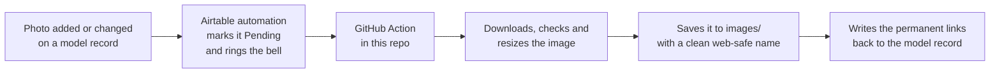

# Model-Image-Repo

Permanent, email-safe hosting for the model images in our Airtable Models base.

This repo is the public home for every model's photo. Airtable remains the
place where images are *managed* — you add or change a photo on the model
record like always — and this repo is where the *shareable copy* of that photo
lives, at a web address that never expires and works inside emails.

**Most people never need to touch this repo.** Everything in `images/` is
generated and maintained automatically. This README explains what happens
behind the scenes, and the few situations where a human needs to step in.

---

## Why this exists

Two facts of life drove this setup:

1. **Airtable attachment links expire after about 2 hours.** They're fine
   inside Airtable, but paste one into an email and the image is a broken
   icon by the time anyone opens it. Airtable does this deliberately — it
   doesn't want to be a public image host.
2. **Our automated emails (sent via the Outlook block in Airtable) are very
   fussy about images.** Through trial and error we established that the only
   image that reliably renders is one served from a **permanent public web
   address** whose URL contains **no underscores or parentheses** (the email
   pipeline mangles those characters), at the **exact pixel size it should
   display** (the email pipeline strips all sizing instructions, so the
   file's own dimensions are the only size control that works).

A public GitHub repo gives us the permanent public addresses; the automation
in this repo takes care of the naming and sizing rules so nobody has to
remember them.

## How it works

In plain terms: when someone changes a model's photo in Airtable, an
automation flags the record and pokes this repo. A robot here (a *GitHub
Action*) wakes up, downloads the photo while Airtable's temporary link is
still fresh, tidies it up, saves it, and writes the permanent web addresses
back onto the model record. The whole round trip normally takes a minute or
two.

Every image is saved twice:

| Folder | What's in it | Used for |
|---|---|---|
| `images/full/` | Full-size version (capped at 800px) | Interfaces, documentation — anywhere with room |
| `images/thumbs/` | 80×80 thumbnail, image centred on a transparent square | **Emails** — the uniform size keeps list layouts tidy |
| `assets/` | A small number of hand-placed files (e.g. the email signature logo) | Managed manually, never touched by the robot |

On the model record, the two generated links land in the **Image URL** and
**Image Thumb URL** fields. Anything that emails an image must use the
*thumbnail* link — in email, images display at whatever size the file
actually is, and 800px is a lot of speaker.

## The status field

Each model carries an **Image Sync Status**:

- **Pending** — a change has been flagged and the robot hasn't processed it
  yet. Normally lasts a minute or two.
- **Published** — done; the URL fields are live and safe to use.
- **Rejected** — the robot couldn't use the attachment. The reason is written
  to the sync note field on the record. The usual causes are a non-image file
  (a PDF, say) or an SVG. **Fix:** replace the attachment with a JPG or PNG
  and the robot will pick it up automatically.

## The safety nets

You don't need to babysit any of this:

- A **weekly sweep** (Tuesday, early morning) catches anything the instant
  automation missed — including images that were added before the automation
  existed.
- Every run **re-checks everything that isn't Published**, so nothing can be
  permanently dropped by a hiccup. Running things twice never causes harm or
  duplicates.
- A sweep can also be run **by hand** any time: on GitHub, open the
  **Actions** tab → *Sync model images from Airtable* → **Run workflow** →
  leave it on `backlog` → green button. Watch the log lines roll past — one
  `OK` or `REJECTED` per model.

## House rules

- **Don't hand-edit anything in `images/`.** The robot owns that folder — it
  names files, replaces them when photos change, and deletes stale ones. A
  hand-placed file there will be ignored at best and cleaned up at worst.
  One-off files that need permanent hosting (logos, etc.) go in `assets/`.
- **Don't rename this repo or its folders** without a chat first — the web
  addresses of every image contain the repo and folder names, so a rename
  breaks every link already sent in an email. (The pipeline will self-heal
  the Airtable records on its next sweep, but emails already in inboxes
  keep pointing at the old address.)
- **The repo must stay public.** That's what makes the image links work
  without a login. Nothing sensitive lives here — it's product photos.
- **File names are machine-generated** — lowercase words and hyphens plus the
  Airtable record ID, e.g. `yamaha-ns-10m-studio-passive-speaker-recLvj1….jpg`.
  The odd-looking `rec…` tail is what lets the robot match a file to its
  record forever, even if the model is renamed.

## If something looks wrong

| Symptom | What it usually means |
|---|---|
| Status stuck on **Pending** | The run may have failed — check the **Actions** tab for a red ✗ and open the log, or just run a manual sweep |
| Status **Rejected** | Read the sync note on the record; almost always "replace the attachment with a JPG/PNG" |
| Image broken in a *received* email | If the record's thumb link opens fine in a private/incognito browser window, the recipient's mail client is blocking remote images (common, and outside our control) |
| A run fails with a "push rejected" message | Someone edited the repo while a sync was mid-flight; the run retries by itself, and the weekly sweep is the final backstop |

## For maintainers

The technical setup — tokens, field IDs, the Airtable automations, and the
processing rules — is documented step-by-step in
[`README-SETUP.md`](README-SETUP.md). The two credentials to keep an eye on:
the Airtable token lives in this repo's Actions secrets, and the GitHub
fine-grained token (scoped to this repo only) lives inside the two Airtable
automations — the latter has an expiry date (Thu, Jul 8 2027), and the only symptom when it
lapses is the watcher automation quietly starting to fail.
